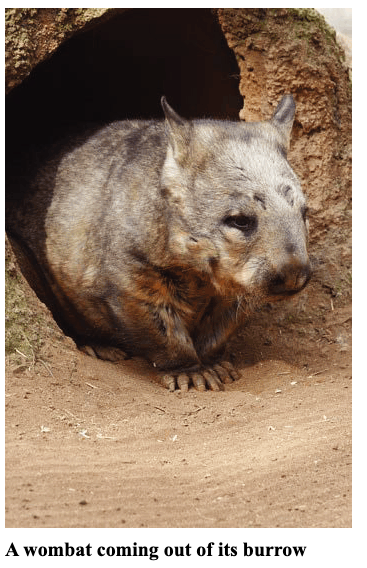

# Grade 4 Informational	Performance	Task: Animals and Their Surroundings

##  Students Directions

###  Task:

Your school’s science fair is taking place soon. Your class has decided to focus on doing science projects about animals. You become interested in learning more about where animals live. You have found three sources about this topic in the school library.

After you have reviewed these sources, you will answer some questions about them. Briefly scan the sources and the three questions that follow. Then, go back and read the sources carefully so you will have the information you will need to answer the questions and complete your research.

In Part 1, you will answer questions about the reading passages. In Part 2, you will write an informational article using information you have read.

**Directions for Beginning:**

You will now review several sources. You can review any of the sources as often as you like.

**Research Questions:**

After reviewing the research sources, use the rest of the time in Part 1 to answer three questions about them. Your answers to these questions will be scored. Also, your answers will help you think about the information you have read, which should
help you write your informational article. 

You may click on the Global Notes button or refer back to your scratch paper to review your notes when you think it would be helpful. Answer the questions in the space below the items.

Both the Global Notes on the computer and your written notes on scratch paper will be available to you in Part 1 and Part 2 of the performance task

### Part 1

**Sources for Performance Task:**

**Source #1**

You have found an article that describes how animals survive in different environments, the places where plants and animals live. 

 <b> It’s a Cold (Hot, Dry, Dark) Cruel World! </b>
 

  by Dawn Baertlein 
 

Living creatures survive in all types of environments. Each environment creates different challenges for animals that live there. Some living creatures survive at the bottom of the sea where it is dark as night and very cold. Other plants and animals
live in dry, hot environments. People can use tools like flashlights or fans to help them survive. Animals and plants, however, must rely on nature to help them survive.

Near the South Pole, in Antarctica, it is very cold. It is usually about minus 57 degrees Fahrenheit. Water freezes at 32 degrees Fahrenheit, so Antarctica is much colder than ice. Scientists live at the South Pole, but they live in buildings with thick
walls and heating. What do animals do?

Some animals have bodies that help them live in the cold. The icefish lives in water so cold that even in summer, chunks of ice continue to float in the water. How do icefish keep from freezing? The only way icefish can survive in this extreme environment is because they have a special substance in their blood that keeps ice crystals from forming inside their bodies.

Penguins have thick layers of fat or blubber to help them stay warm, but sometimes even that is not enough! Often penguins must rely on each other for survival. They cuddle up together as close as they can to share their body heat.

Another area that can be hard to live in is the dry, hot desert. People who live in the desert often wear special clothes to protect them from the heat. When they build homes they have air conditioners to keep them cool and to find water they dig wells that provide water from deep in the ground. How do animals survive in the hot, dry conditions?

Many desert animals come out only at night, when it’s cool. Snakes, lizards, mice, and squirrels live in burrows. During the day, they stay under the ground and out of the sun.

In the hot Sonoran Desert of Arizona, an owl lives in a nest that sits on a tall cactus. The cactus stems store water. Rain doesn’t fall often in the Sonoran Desert, but when it does, it falls quickly and heavily. Then the water quickly flows away. The cactus has roots that spread out only inches below the surface of the soil. The roots are like a big sponge, soaking up rainwater fast. Now the cactus can store water for months and the owl has a nice home high up in the cactus. 

 

The ocean has very different challenges from those of the desert. The deepest pails of the ocean are very dark and cold because the sun’s rays are unable to shine through all of the layers of water. Some of the very deepest pails of the ocean have thermal vents on the ocean floor that are like little volcanoes under the sea. The water coming out of the vents is very hot. Crabs survive at the bottom of the food.

Arctic chill, desert sun, and cold, pitch-dark ocean—these are difficult conditions that would be hard for people to survive. But nature gives plants and animals the ability to live almost anywhere. 

**Sources Used:**

Casey, B. (2006, June 19). Fish produces natural antifreeze to stay alive. Retrieved from
http://www.nbcnews.com/id/13426864/ns/technology_and_science-science/t/fishproduces-natural-antifreeze-stay-alive

Hill, K. (2007, September 15). What animal never drinks water in its entire life? Retrieved
from http://www.bigsiteofamazingfacts.com.

Sea World Parks and Entertainment (n.d.). Polar bears behavior. Retrieved from
http://www.seaworld.org/animal-info/info-books/polar-bear/

The Mariana Trench (n. d.), The Mariana Trench – Biology. Retrieved from
http://www.marianatrench.com/mariana_trench-biology_001.htm.

Photo of owl on cactus (Image 1598R-10034017), copyright by Superstock, Used by
permission. 

**Source #2**

You have found an article from Appleseeds magazine that describes how some animals build their homes. 

 <b> Animal Architects  </b>
 

  by Donna Henes 
 

**Everybody Needs a Home**

Homes protect us from weather and keep us safe and comfortable. Animals are no exception.

Humans live in a wide variety of structures. Around the world people have designed and built their homes to suit their particular needs and ways of life. Animals do the same.

In addition to making living places, people and animals both build other structures: bridges, dams, traps, and storage areas. These structures help people and animals survive.

People and animals both use different materials and methods for their construction. They build with wood, weave with fibers and vines, dig into the earth, and mold out of mud.

From sky-high nests to elaborate (or fancy) tunnels, the amazing works of animal architects (or building designers) rival those of the greatest uman engineers. Let’s take a look at some.

Beavers build lodges along the banks of lakes and ponds. Using branches they chew apart themselves, beavers begin by building a one-shaped frame. Then they fill in the gaps with mud and leaves. The entrance to the lodge is always at the bottom, underwater, so beavers can come and go without being seen by predators.

In addition to their lodges, beavers build dams. Water builds up behind the dams, creating flooded areas that are ideal places for beavers to find food. The flooded areas also provide pools for other wildlife.

Termites build 20-foot-high mounds out of dirt and their own saliva. These giant structures are like small apartment buildings. Besides living areas, these towers have food storage areas, nurseries for “baby” termites, a special chamber for the king and queen, and even gardens. (A chamber is like a room.) 

 

**A wombat coming out of its burrow**

Wombats dig huge underground burrows that can be 100 feet long. Wombat tunnels are elaborate, with many entrances, side tunnels, and resting chambers. Inside the burrow, sleeping nests are built on raised “platforms” to keep them dry in case of flooding. Often, several burrows are connected, creating structures so large they can actually be seen from space! . . .

Bald eagles build massive nests—4 to 5 feet across and 3 to 6 feet deep—high in tall trees. They use their beaks and amazingly strong talons [or claws] to break branches and twigs for nest material. Like beavers, eagles begin by building a stick frame. Then, they weave in smaller branches and twigs for added strength and protection. Finally, eagles line their nests with grasses and other soft material to make them comfy.

Take a look around you. [You may] find other examples of amazing animal architecture. 

**Sources Used:**

Henes, D. (2009). Animal architects. Appleseeds, 11(7). 16-18.

Photograph of termite mound (Image 4268R-11707), copyright by Superstock. Used by
permission.

Photograph of wombat in burrow (Image 1889R-38764), copyright by SuperStock. Used by
permission. 

**Source #3**

You have found an article that discusses plants and animals that live in the same
place. The article describes how these plants and animals depend on each other to
stay alive.

 <b> Don’t Step on the Ecosystem! *1  </b>
 

  by Courtney Duke 
 

The next time you go out, take a careful look around. Maybe you see a small pond. Plants might be growing ¡n the pond, birds might take baths in it and, if you’re lucky, the pond might even be a home to tadpoles.

Any place where plants and animals live and interact (work together) with nonliving things (like air, water, and soil) is called an ecosystem. The plants and animals ¡n an ecosystem need each other to survive. It is important that there is a balance among all things in an ecosystem. A small change in any part of an ecosystem can have a big effect. For example, if the food that an animal eats can no longer be found, then that animal will either die or have to leave that ecosystem. When that animal is no longer a part of the ecosystem, then the rest of the living and
nonliving parts of the ecosystem are affected because all parts of the ecosystem depend on each other.

All parts of an ecosystem are connected to each other. Think about an oak tree in the forest. It is a home to the bugs and birds that live in its bark and branches, and to the squirrels who make their nests in its trunk. The oak tree also provides food to other animals in the ecosystem. When its acorns are ripe, they fall to the forest floor. These rich nuts are good food for the mice and deer that eat these to fatten
up for the winter. Mice save the acorns so that they have food in the winter months, and in the spring, hawks swoop down looking for a mouse meal. In a way, the oak tree helps the hawk find its food. This is an example of how the plants and animals in an ecosystem work together in order to survive.

Now think of the ocean. Imagine diving into the deep blue water. Near the surface, you see a rocky ridge of coral called a coral reef. The reef is home to many plants and animals. For example, sea plants move back and forth in the current, and fish come to feed or to hide from other living things that can harm them. Coral reefs, in fact, are home to about one-quarter of all the fish in the sea. Reefs also attract
birds, whales, turtles, and seals. The number and many different types of animals that depend upon coral reefs make them one of the most important ecosystems in the world.

There are many different kinds of ecosystems, and they can be very small like a pond or very big like a coral reef ecosystem. Ecosystems are verywhere. 

*1 ecosystem: an area where plants, animals, and other nonliving things live and depend on each other for survival 

**Sources Used:**

Geography for kids. (n.d.). Ecosystems. Retrieved https://kidsgeo.com/geography-forkids/ecosystems/

Salpietra, M. (2009, February 24). Population ecology. Retrieved from
https://www.pbs.org/wgbh/nova/nature/population-ecology.html.

The Franklin Institute (n.d.). Ecosystems, biomes, and habitats. Retrieved from
http://learn.fi.edu/tfi/units/life/habitat/.

Pala, C. (2008, September). Our imperiled oceans: victory at sea. Retrieved from:
http://www.smithsonianmag.com/science-nature/our-imperiled-oceans-victory-at-sea7468851/. 

**Part 1: ASSESSMENT ITEMS**

1.	 Source #1 discusses what some animals do to survive in their environment. Explain how the information in Source #2 adds to the reader’s understanding of what some animals do to survive in their environment. Give two details from Source #2 to support your explanation. (short constructed response) 

[Answer here](https://docs.google.com/document/d/16_VnNnKtU80tNbNoWMEzjg62Wm9DV2RXXuDRqT_IZ_s/edit?usp=sharing) 

2.	 Which source would most likely be the most helpful in understanding how plants and animals work and live together to allow the place where they live to continue to grow? Explain why this source is most likely the most helpful. Use two details from the source to support your explanation. (short constructed response) 

3.	 Click on the boxes to match each source with the idea or ideas that it supports. Some may have more than one source selected.

 

**Part 2: Animals and Their Surroundings Informational Performance Task**

**Student Directions**

You will now review your notes and sources, and plan, draft, revise, and edit your writing. You may use your notes and go back to the sources. Now read your assignment and the information about how your writing will be scored, and then begin your work.

**Your Assignment** 

Your teacher wants each student to write an informational article that will be displayed with your science fair project. You decide to write about animals and where they live. Your article will be read by other students, teachers, and parents.

Using more than one source, develop a main idea about animals and their surroundings. Choose the most important information from more than one source to support your main idea. Then, write an informational article about your main idea that is several paragraphs long. Clearly organize your article and support your main idea with details from the sources. Use your own words except when quoting directly from the sources. Be sure to give the source title or number when using details from the sources. 

**REMEMBER: A well-written informational article**

-	 has a clear main idea
-    is well-organized and stays on the topic
-    has an introduction and conclusion
-    uses transitions
-    uses details from the sources to support your main idea
-    puts the information from the sources in your own words, except when using
-    direct quotations from the sources
-    gives the title or number of the source for the details or facts you included
-	 develops ideas clearly
-	 uses clear language
-	 follows rules of writing (spelling, punctuation, and grammar) 

**Now being work on your informational article.** Manage your time carefully so that you can
1. Plan your informational article.
2. Write your informational article
3. Revise and edit the final draft of your informational article. 

Word processing tools and spell check are available to you.

For Part 2, you are being asked to write an informational article that is several paragraphs long. Type your response in the box below. The box will get bigger as you type.

Remember to check your notes and your pre-writing/planning as you write, and then revise and edit your informational article. 