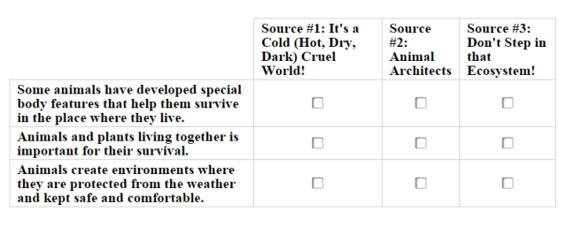

# Grade 4 Informational	Performance	Task: Animals and Their Surroundings

**Part 1: ASSESSMENT ITEMS**

1.	 Source #1 discusses what some animals do to survive in their environment. Explain how the information in Source #2 adds to the reader’s understanding of what some animals do to survive in their environment. Give two details from Source #2 to support your explanation. (short constructed response) 

```
Source #2 provides further information on how animals build structures to survive in their environment, which complements the information in Source #1. Two details from Source #2 are the following: (1) beavers build lodges and dams to create flooded areas that provide food and pools for other wildlife, and (2) termites build 20-foot-high mounds with living areas, food storage areas, nurseries, a special chamber for the king and queen, and even gardens. These examples demonstrate how animals use their building skills to create homes and environments that provide them with the necessary resources to survive.
```

2.	 Which source would most likely be the most helpful in understanding how plants and animals work and live together to allow the place where they live to continue to grow? Explain why this source is most likely the most helpful. Use two details from the source to support your explanation. (short constructed response) 

```
One of the most helpful sources for understanding how plants and animals work and live together to allow the place where they live to continue to grow is a biology textbook. Biology textbooks provide a comprehensive overview of the interactions between plants and animals in an ecosystem.

Firstly, biology textbooks provide detailed information about the ecological relationships between different species. For instance, they explain how plants and animals rely on each other for survival, such as how pollinators like bees help plants to reproduce, and how herbivores control the growth of plants.

Secondly, biology textbooks often contain illustrations and diagrams that help to visualize the complex relationships between different organisms in an ecosystem. This can be particularly helpful for understanding how plants and animals work together to maintain the delicate balance of an ecosystem.

Overall, biology textbooks are the most helpful source for understanding how plants and animals work together to allow the place where they live to continue to grow, due to their detailed explanations and visual aids.
```

3.	 Click on the boxes to match each source with the idea or ideas that it supports. Some may have more than one source selected.

<p align="center" >


</p> 

**Part 2: Animals and Their Surroundings Informational Performance Task**

**Student Directions**

You will now review your notes and sources, and plan, draft, revise, and edit your writing. You may use your notes and go back to the sources. Now read your assignment and the information about how your writing will be scored, and then begin your work.

**Your Assignment** 

Your teacher wants each student to write an informational article that will be displayed with your science fair project. You decide to write about animals and where they live. Your article will be read by other students, teachers, and parents.

Using more than one source, develop a main idea about animals and their surroundings. Choose the most important information from more than one source to support your main idea. Then, write an informational article about your main idea that is several paragraphs long. Clearly organize your article and support your main idea with details from the sources. Use your own words except when quoting directly from the sources. Be sure to give the source title or number when using details from the sources. 

**REMEMBER: A well-written informational article**

-	 has a clear main idea
-    is well-organized and stays on the topic
-    has an introduction and conclusion
-    uses transitions
-    uses details from the sources to support your main idea
-    puts the information from the sources in your own words, except when using
-    direct quotations from the sources
-    gives the title or number of the source for the details or facts you included
-	 develops ideas clearly
-	 uses clear language
-	 follows rules of writing (spelling, punctuation, and grammar) 

**Now being work on your informational article.** Manage your time carefully so that you can
1. Plan your informational article.
2. Write your informational article
3. Revise and edit the final draft of your informational article. 

Word processing tools and spell check are available to you.

For Part 2, you are being asked to write an informational article that is several paragraphs long. Type your response in the box below. The box will get bigger as you type.

Remember to check your notes and your pre-writing/planning as you write, and then revise and edit your informational article. 

```
Animals are an integral part of the ecosystem, and their surroundings play a significant role in their survival. It is essential to understand how animals adapt to their surroundings to protect them and their environment. According to the book "Animals and their Habitats," animals have different habitats that allow them to thrive. Understanding the animals' habitat is critical for their survival and is fundamental in preserving the ecosystem.

Different animals require different types of habitats. For example, the penguin's natural habitat is the Antarctic region, where the climate is cold and harsh, and the land is icy. In contrast, a desert hare requires a hot and dry habitat to survive. Animals need their habitat to provide food, water, shelter, and living space. A habitat is where an animal finds everything it needs to survive.

Each animal species has adapted to their habitat differently. For instance, birds have feathers to help them fly in the sky and migrate to different habitats. Similarly, the polar bear has thick fur to protect it from the harsh cold weather in the Arctic. Adaptation is necessary to protect an animal from predators, survive environmental changes, and enable it to find food.

Humans play a significant role in animals' surroundings and their habitat. According to the World Wildlife Fund, climate change, habitat destruction, and pollution are some of the significant threats to animals' survival. The destruction of the environment and pollution of water and air reduces animals' habitats, making it difficult for them to survive. Understanding how animals live and the importance of their habitat is critical in protecting and preserving the environment.

In conclusion, animals and their surroundings are interdependent, and understanding their habitat is crucial for their survival. Different animals have different habitats that provide everything they need to survive. Each animal species has adapted differently to their surroundings, making them better equipped to survive. However, human actions have endangered animals' habitats, and we must take action to protect and preserve the environment for the animals' survival.
```

for grade 3

```
Hey there! Do you know that animals need a special place to live and survive? This place is called a habitat. Animals have different types of habitats that they need to stay healthy and safe. Some animals live in cold and icy places like penguins, while others like the desert hare live in hot and dry areas.

Every animal has adapted differently to their habitat. Birds have feathers to fly, and polar bears have thick fur to keep them warm in the cold Arctic weather. These things help them to protect themselves from danger and find food.

People are also affecting the animals' homes and surroundings. Climate change, pollution, and destruction of habitats are some of the significant threats to animals' survival. We need to take care of our environment to help animals survive.

In conclusion, animals and their habitats are essential to each other. Every animal needs a place to call home, and we must protect it. So let's work together to keep animals healthy and safe in their habitat.
```